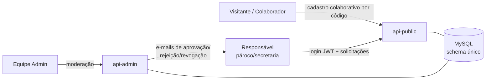
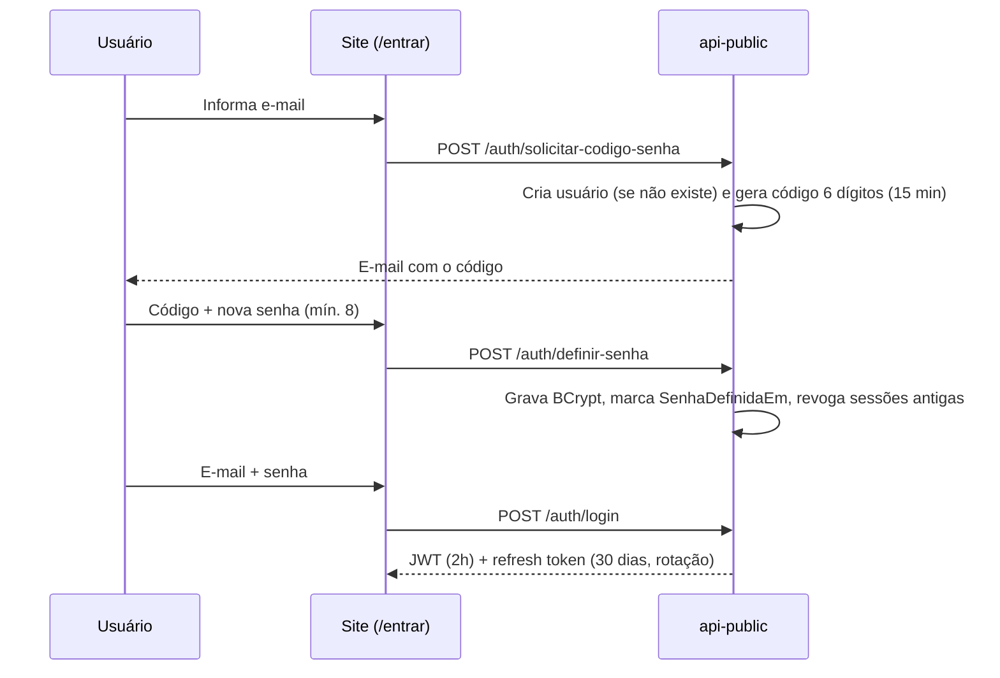
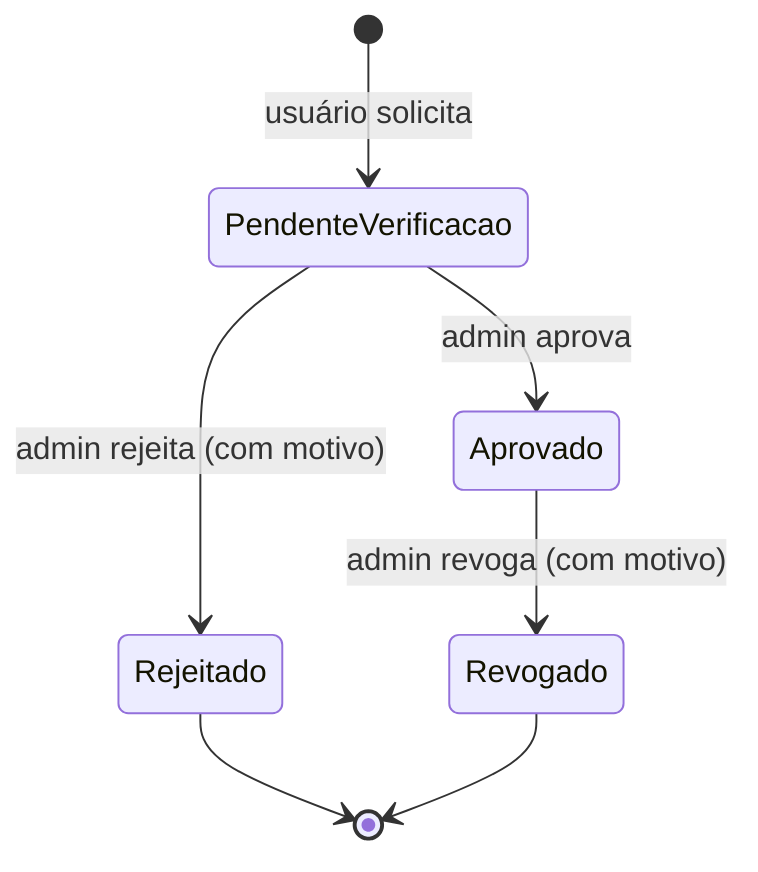
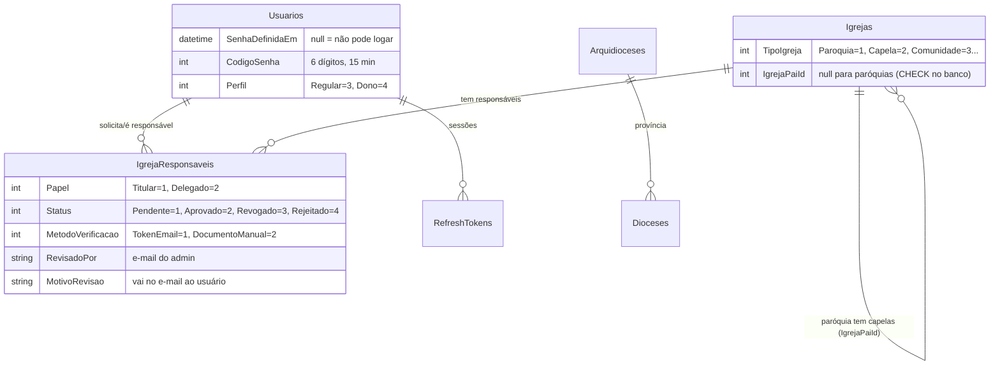

# Como funciona — Responsável Verificado

Documentação funcional e técnica do fluxo de **Responsável Verificado**: o mecanismo que permite que o responsável oficial por uma igreja (pároco, secretaria) assuma a gestão das informações da página dela no BuscaMissa, mantendo o site colaborativo para todo o resto.

> Checklist de execução e status das fases: [plano-responsavel-verificado.md](plano-responsavel-verificado.md)

---

## 1. Visão geral

O BuscaMissa sempre foi colaborativo: qualquer pessoa cadastra/atualiza uma igreja validando por código de e-mail. Isso continua. O que muda é que agora existe um **caminho paralelo** para quem é responsável oficial pela igreja:

| | Colaborador (como sempre foi) | Responsável Verificado (novo) |
|---|---|---|
| Quem é | Qualquer visitante | Pároco, secretaria ou delegado da igreja |
| Login | Não tem — valida cada ação por código de e-mail | Conta com e-mail + senha (JWT) |
| O que pode | Sugerir cadastro/atualização (passa por validação) | Editar direto: endereço, contato, horários, redes sociais, imagem |
| Selo na página | — | "Responsável Verificado ✓" (fase 5) |

## 2. Atores e serviços



- **api-public** — autenticação do usuário final (`/api/v1/auth`) e fluxo de solicitação/permissão (`/api/v1/responsavel`).
- **api-admin** — dono do schema (todas as migrations) e moderação (`/api/v1/admin/responsaveis`).
- **E-mails** — factory multi-provider (SendGrid/SendPulse) já em produção.

## 3. Etapa A — Conta e login (Fase 3)

O usuário cria a senha **sem cadastro prévio**: o mesmo fluxo serve para primeiro acesso e para "esqueci minha senha".



Pontos de segurança:
- Mensagens **neutras** (não revelam se o e-mail é cadastrado nem qual credencial errou).
- Usuário criado pelo fluxo colaborativo antigo tem senha temporária aleatória e **não consegue logar** até definir a própria senha (`SenhaDefinidaEm`).
- Refresh token: só o **hash SHA-256** vai ao banco; cada uso rotaciona (reuso do antigo → 401); trocar senha revoga todas as sessões.
- Rate limiting: 5 req/min por IP em todos os endpoints de auth.

## 4. Etapa B — Solicitar responsabilidade (Fase 4)

Logado, o usuário pede a gestão de uma igreja (na página da igreja, botão "Sou o responsável" — fase 5):

```
POST /api/v1/responsavel/igreja/{igrejaId}/solicitar
{ "cargoInformado": "Pároco", "observacao": "..." }
```

- Cria um vínculo `IgrejaResponsavel` com status **PendenteVerificacao**.
- Duplicata (já tem pendente/aprovada para a mesma igreja) → 409.
- Hoje todo pedido cai em **análise manual** do admin (`MetodoVerificacao = DocumentoManual`); verificação automática por e-mail institucional é evolução futura.

## 5. Etapa C — Moderação (Fase 4/7)

A equipe admin trabalha a fila em `/api/v1/admin/responsaveis/pendentes`:



Efeitos colaterais:
- **Aprovar** → usuário vira perfil `Dono` + **e-mail de boas-vindas**.
- **Rejeitar** → e-mail com o motivo (pode solicitar de novo com mais informações).
- **Revogar** → e-mail com o motivo; se era o último vínculo aprovado do usuário, o perfil volta a `Regular`.
- Nada é excluído: `Rejeitado`/`Revogado` ficam na tabela para auditoria e resolução de disputas.

## 6. Regra de permissão — "responsável local vence"

Uma paróquia pode ter capelas/comunidades filhas (`Igreja.IgrejaPaiId`). A permissão de edição segue três degraus, sempre nesta ordem:

```mermaid
flowchart TD
    Q1{A igreja tem responsável<br/>APROVADO próprio?} -->|Sim| L[Só ele(s) editam.<br/>Herança NÃO se aplica.]
    Q1 -->|Não| Q2{É capela/comunidade<br/>com paróquia-pai?}
    Q2 -->|Sim| H[Herda os responsáveis<br/>aprovados da paróquia-pai]
    Q2 -->|Não| C[Ninguém tem edição direta.<br/>Fluxo colaborativo continua valendo.]
```

Exemplo prático (validado em teste):
1. Padre José é aprovado como responsável da **Paróquia São José** → edita a paróquia **e** as capelas Santa Rita e N. Sra. (herança).
2. A secretaria da **Capela Santa Rita** é aprovada como responsável local → **só ela** edita a Santa Rita; Padre José continua editando a paróquia e a N. Sra.
3. O vínculo da secretaria é revogado → a herança do Padre José sobre a Santa Rita é **restaurada automaticamente**.

Consultas para o front:
- `GET /api/v1/responsavel/minhas-igrejas` — vínculos diretos + herdadas (flag `porHeranca`).
- `GET /api/v1/responsavel/igreja/{id}/pode-editar` — resolve a regra acima.

## 7. Modelo de dados (resumo)



Decisões de modelagem:
- `IgrejaResponsavel` é **separada** de `Igreja.UsuarioId` (este é "quem cadastrou" no fluxo colaborativo — semântica diferente). Uma igreja pode ter vários responsáveis (padre + secretaria) e o histórico importa.
- `Dioceses`/`Arquidioceses` (Fase 1) são a fundação para relacionar paróquias futuramente (`Igreja.DioceseId` — fora de escopo por ora).
- Só o **api-admin roda migrations** (aplicadas pela pipeline no deploy); o api-public tem réplicas somente-leitura dos models.

## 8. O que não muda

- Cadastro colaborativo por código de e-mail: **intocado** — continua sendo o caminho para igrejas sem responsável.
- Token estático de App no frontend: continua para chamadas anônimas; o JWT do usuário logado tem prioridade quando existe (AuthInterceptor).
- Favoritos, busca, confirmação de horários: sem alteração.

## 9. Status das entregas

| Fase | Conteúdo | Status |
|---|---|---|
| 1 | Arquidioceses/Dioceses (admin) | ✅ Em dev |
| 2 | Hierarquia (TipoIgreja/IgrejaPaiId) | ✅ Em dev |
| 3 | Auth (senha + JWT + /entrar) | ✅ Em dev |
| 4 | IgrejaResponsavel + moderação + e-mails | 🔄 PRs abertos |
| 5 | Botão "Sou o responsável" + badge (site) | ⏳ |
| 6 | Painel do responsável (site) | ⏳ |
| 7 | Tela de moderação (admin) | ⏳ endpoints prontos |
